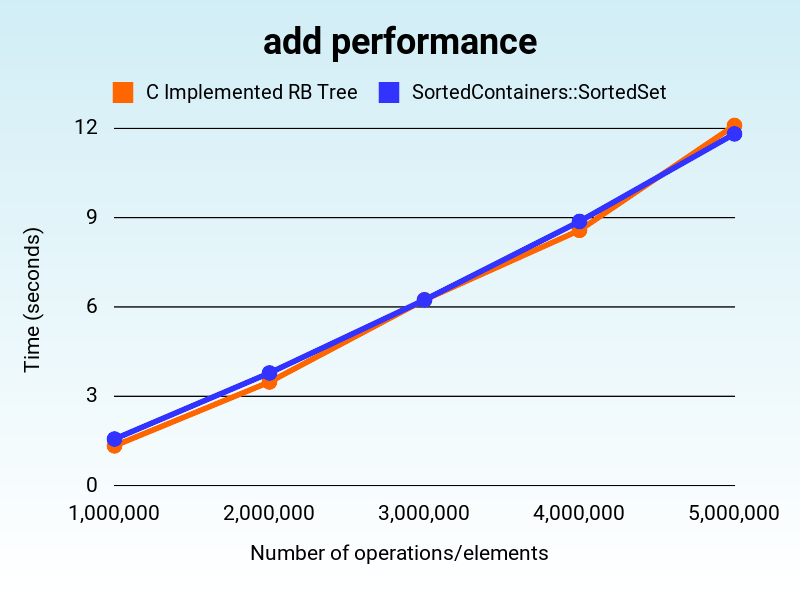

# SortedContainers

SortedContainers is a fast implementation of sorted lists, sets, and dictionaries in pure Ruby. It is based on the [sortedcontainers](https://grantjenks.com/docs/sortedcontainers/) Python library by Grant Jenks.

SortedContainers provides three main classes: `SortedArray`, `SortedSet`, and `SortedHash`. Each class is a drop-in replacement for the corresponding Ruby class, but with the added benefit of maintaining the elements in sorted order.

SortedContainers exploits the fact that modern computers are really good at shifting arrays in memory. We sacrifice theroetical time complexity for practical performance. In practice, SortedContainers is fast.

## How it works

Computers are good at shifting arrays. For that reason, it's often faster to keep an array sorted than to use the usual tree-based data structures.

For example, if you have the array `[1, 2, 4, 5]` and want to insert the element `3`, you can shift `4, 5` to the right and insert `3` in the correct position. This is a `O(n)` operation, but in practice it's fast.

But we can do better if we have a lot of elements. We can break up the array into smaller arrays so the shifts don't have to move so many elements. For example, if you have the array `[[1,2,4], [5,6,7]]` and you want to insert the element `3`, you can insert `3` into the first array to get `[[1,2,3,4], [5,6,7]]` and only the element `4` has to be shifted.

This often outperforms the more common tree-based data structures like red-black trees with `O(log n)` insertions and deletions. In practice, the `O(n)` insertions and deletions of SortedContainers are faster.

How big the subarrays are is a trade-off. You can modify how big you want to subarrays by setting the `load_factor`. The default is set to DEFAULT_LOAD_FACTOR = 1000. The subarray is split when its size is `2*load_factor`. There is no perfect value. The ideal value will depend on your use case and may require some experimentation.

## Benchmarks
 
Performance comparison against [SortedSet](https://github.com/knu/sorted_set) a C extension red-black tree implementation. Every test was run 5 times and the average was taken.

You can see that SortedContainers has compariable performance for add and delete, and much better performance for iteration, initialization, and include.

Note: I do not know why initialization is faster for 4 million than 3 million elements. This was consistant across multiple runs.

- MacBook Pro (16-inch, 2019)
- 2.6 GHz 6-Core Intel Core i7, 16 GB 2667 MHz DDR4
- Ruby 3.2.2
- SortedContainers 0.1.0
- SortedSet 1.0.3
### Results (Lower is better)




## Installation

Add this line to your application's Gemfile:

```ruby
gem 'sorted_containers'
```

And then execute:

```bash
bundle install
```

Or install it yourself as:
    
```bash
gem install sorted_containers
```

## Usage

    require 'sorted_containers'

    # Create a new SortedArray
    list = SortedContainers::SortedArray.new

    # Add elements to the list
    list << 3
    list << 1
    list << 2

    # Access elements by index
    puts list[0] # => 1
    puts list[1] # => 2
    puts list[2] # => 3

    # Access elements by index
    puts list.first # => 1
    puts list.last # => 3

    # Remove elements from the list
    list.delete(2)

    # Iterate over the list
    list.each do |element|
      puts element
    end

    # Create a new SortedSet
    set = SortedContainers::SortedSet.new

    # Add elements to the set
    set << 3
    set << 1
    set << 2

    # Access elements by index
    puts set[0] # => 1
    puts set[1] # => 2
    puts set[2] # => 3

    # Access elements by index
    puts set.first # => 1
    puts set.last # => 3

    # Remove elements from the set
    set.delete(2)

    # Iterate over the set
    set.each do |element|
      puts element
    end

    # Create a new SortedHash
    dict = SortedContainers::SortedHash.new

    # Add elements to the dict
    dict[3] = 'three'
    dict[1] = 'one'
    dict[2] = 'two'

    # Access elements by key
    puts dict[1] # => 'one'
    puts dict[2] # => 'two'
    puts dict[3] # => 'three'

    # Access elements by index
    puts dict.first # => [1, 'one']
    puts dict.last # => [3, 'three']

    # Remove elements from the dict
    dict.delete(2)

    # Iterate over the dict
    dict.each do |key, value|
      puts "#{key}: #{value}"
    end

## Development

After checking out the repo, run `bin/setup` to install dependencies. Then, run `rake spec` to run the tests. You can also run `bin/console` for an interactive prompt that will allow you to experiment.

To install this gem onto your local machine, run `bundle exec rake install`. To release a new version, update the version number in `version.rb`, and then run `bundle exec rake release`, which will create a git tag for the version, push git commits and the created tag, and push the `.gem` file to [rubygems.org](https://rubygems.org).

## Contributing

Bug reports and pull requests are welcome on GitHub at https://github.com/GarrisonJ/sorted_containers. This project is intended to be a safe, welcoming space for collaboration, and contributors are expected to adhere to the [code of conduct](https://github.com/GarrisonJ/sorted_containers/blob/main/CODE_OF_CONDUCT.md).

## License

The gem is available as open source under the terms of the [MIT License](https://opensource.org/licenses/MIT).

## Code of Conduct

Everyone interacting in the SortedContainers project's codebases, issue trackers, chat rooms and mailing lists is expected to follow the [code of conduct](https://github.com/GarrisonJ/sorted_containers/blob/main/CODE_OF_CONDUCT.md).
